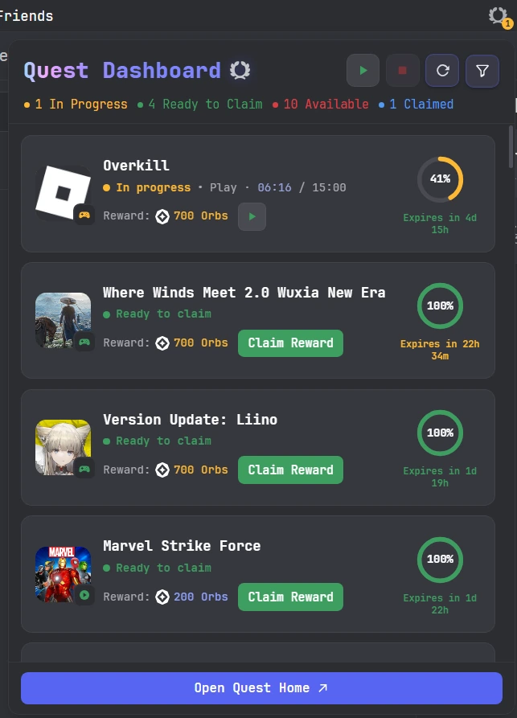
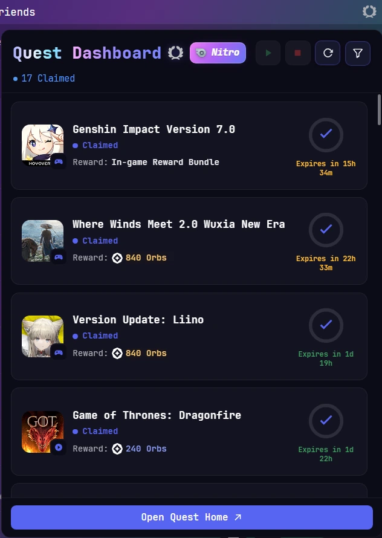
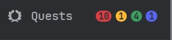

# QuestUI

QuestUI is a standalone Vencord userplugin for quick access to Discord Quests and a compact, live view of their state.

QuestUI is UI-focused rather than a Quest-completion engine. It can perform two narrowly scoped Quest mutations only when **you click them yourself** — **Accept Quest** and **Claim Reward**. It does not generate Quest progress, spoof games/streams, auto-claim, or bypass Discord challenges.

## Release channels

> [!IMPORTANT]
> **Stable** tracks `main` and is the recommended QuestUI build for normal use.
>
> **Beta** tracks `feat/quest-actions-orion-controls`. Dashboard Mode and Dashboard • Orion Integration are enabled by default in the Beta build. The beta Orion-control feature set must be paired with `Herzchens/discord-quest-completer` branch `feat/per-quest-pause-resume`. The current known-compatible Orion checkpoint is `39eef8603485be36afd18b813931e528a61728ab`.
>
> Upstream `nyxxbit/discord-quest-completer` does not currently expose the pause/resume companion surface required by the beta smart/per-Quest controls. QuestUI remains a separate plugin: without the compatible Orion branch, the Dashboard, filters, counters, native Reload, and manual Accept/Claim can still work, but the beta Orion controls are not available.

Planned release labels for this split are **v1.0.1** for Stable and **v1.1.0-beta.1** for the beta prerelease.

## Preview

<p align="center">
  
  
</p>

<p align="center">
  
</p>

The captures above are real Discord runtime screenshots supplied by the maintainer. They are documentation assets only and are not bundled into the runtime UI.

## Features

- Optional Quest shortcut in Discord's top bar
- Optional Quest shortcut next to mute, deafen, and settings
- Optional **Dashboard Mode** with a live mini Quest dashboard
- Discord Quest artwork, task-type badges, reward display, native progress ring, and expiry display
- Explicit **Accept Quest** and **Claim Reward** actions
- Account-scoped duplicate-submission guards and Vencord-native toast feedback
- Floating filters for status, reward category, and Quest type
- **Recommended** and **Clear all** filter shortcuts
- Optional numeric **Detailed Status** badge and basic attention dot
- Color-coded counters on Discord's own Quest Home links
- Native **Reload** that asks Discord to refetch the current Quest list without Ctrl+R
- Nitro Orb reward display using Discord's current 1.2x multiplier rules where eligible
- Beta-only compatible Orion integration:
  - Smart **Start / Pause / Resume** global control
  - Separate **Stop** engine control
  - Compact exact-ID per-Quest **Pause / Resume** control after enrollment
  - Engine-wide Start when Orion is stopped

QuestUI does not turn Stop into Pause, does not reset Quest progress, and does not implement a targeted `startQuest`. Orion's own scheduler and concurrency limits decide which enrolled Quests run or queue.

## Installation

### Stable

For the stable channel, install the default `main` branch.

#### UserpluginInstaller

Use the repository URL:

```text
https://github.com/Herzchens/QuestUI
```

#### Manual Vencord source install

```bash
cd Vencord/src/userplugins
git clone --branch main https://github.com/Herzchens/QuestUI.git QuestUI
cd ../..
pnpm build
pnpm inject
```

### Beta + compatible Orion companion

For the full beta feature set, install **both** branches below as separate Vencord userplugins:

```bash
cd Vencord/src/userplugins

git clone --branch feat/quest-actions-orion-controls https://github.com/Herzchens/QuestUI.git QuestUI
git clone --branch feat/per-quest-pause-resume https://github.com/Herzchens/discord-quest-completer.git OrionQuests

cd ../..
pnpm build
pnpm testTsc
pnpm inject
```

Do not copy one plugin into the other or build a combined source tree. QuestUI and OrionQuests remain separately maintained plugins.

After an amended/rebased beta update, prefer `git fetch` + an explicit reset after checking the worktree is clean rather than a blind `git pull`:

```bash
git -C Vencord/src/userplugins/QuestUI fetch origin --prune
git -C Vencord/src/userplugins/QuestUI reset --hard origin/feat/quest-actions-orion-controls

git -C Vencord/src/userplugins/OrionQuests fetch origin --prune
git -C Vencord/src/userplugins/OrionQuests reset --hard origin/feat/per-quest-pause-resume
```

## Dashboard

The visible heading is **Quest Dashboard** followed by Discord's native Quest icon.

If the current Discord user has an active Nitro `premiumType`, QuestUI shows a colored **Nitro** tag. Discord profile badge artwork is used when available; if the artwork has not been hydrated, the tag stays visible with QuestUI's fallback glyph rather than incorrectly hiding Nitro status.

The title uses a seamless right-to-left color sweep. `prefers-reduced-motion` disables the motion and keeps the title readable.

The summary row is independent of card filters where appropriate:

- **Yellow** — In Progress
- **Green** — Ready to Claim
- **Red** — Available
- **Blue / Blurple** — Claimed

The Claimed count is always shown and is calculated from the full live Quest snapshot, even when Claimed cards are hidden by the current filter.

### Filters

The Filter popout supports:

- Status: Available, In Progress, Ready to Claim, Claimed, Expired
- Reward: All rewards, Orbs only, Non-Orb rewards
- Quest type: Play, Stream, Video, Activity, Other / Unknown

**Recommended** shows Available, In Progress, and Ready to Claim while hiding Claimed and Expired cards. **Clear all** enables all supported statuses and categories.

### Live progress

QuestUI reads Discord's native Quest selectors and QuestStore rather than running a separate progress engine.

For timed tasks, the secondary progress copy uses fixed `mm:ss / mm:ss` formatting, for example:

```text
Play · 03:02 / 15:00
```

Only the **current elapsed value** (`03:02`) receives completion-stage color. The task label, separator, slash, and target remain neutral so progress color does not leak across the whole row.

The color progression is semantic progress, not urgency: muted at the beginning, then Discord brand tones, then positive green as completion approaches.

Dashboard expiry copy is shown only when the Quest expiry is within **15 days** of the current time. This is presentation-only; the underlying expiry/status data is not changed.

### Rewards

Orb rewards reuse Discord's themed Orb component. QuestUI keeps Discord's base reward value unchanged and adjusts only the displayed amount when the current account qualifies for Discord's Nitro Orb multiplier.

Examples:

- `200 Orbs` → `240 Orbs`
- `700 Orbs` → `840 Orbs`

Nitro Basic and fractional/credit-only Nitro states are not treated as eligible for this reward multiplier.

## Manual Accept and Claim

Dashboard cards expose a mutation only when the normalized Quest state calls for it:

- **Available** → **Accept Quest**
- **Ready to Claim** → **Claim Reward**

Every mutation requires an explicit click. QuestUI re-reads the current Quest from Discord's QuestStore immediately before acting and does not optimistically mark the Quest accepted or claimed.

Enrollment reuses Discord's native Quest enrollment action. While pending, the card shows **Processing…**. A compatible Orion beta build is auto-started only after Discord confirms `enrolledAt` in QuestStore.

Reward claim likewise reuses Discord's native claim path. Unknown, malformed, or ambiguous reward targets fail closed instead of being guessed. QuestUI does not solve/bypass CAPTCHA or other Discord verification challenges and does not auto-retry them.

## Orion beta integration

The beta integration is intentionally narrow. QuestUI validates the registered `orion` command and the companion surface before showing callable controls.

The compatible fork exposes source-of-truth engine/task state plus:

- engine Start/Stop
- global Pause/Resume
- exact-ID per-Quest Pause/Resume
- state-change subscriptions

Global header order:

```text
Smart Start/Pause/Resume → Stop → Reload → Filter
```

State rules:

- no Available/In-Progress Quest → Smart and Stop disabled
- engine stopped + unfinished work → Start enabled, Stop disabled
- engine stopped + explicit paused work → Resume enabled, Stop disabled
- engine running + RUNNING/QUEUE → Pause enabled, Stop enabled
- engine running + only PAUSED controllable work → Resume enabled, Stop enabled
- short startup/scanning window without a published controllable row → Smart disabled, Stop enabled

Start and Resume deliberately use the **same Play icon**. Pause uses a real two-bar yellow Pause SVG. Stop remains engine shutdown/cleanup.

Per-Quest UI after confirmed enrollment:

- engine stopped → Start the global engine
- RUNNING/QUEUE → exact-ID Pause
- PAUSED → exact-ID Resume
- unknown/scanning while engine runs → disabled control rather than guessed state
- completed → Orion control disappears and Claim Reward becomes available

QuestUI does not import Orion farming internals and does not fabricate a Discord channel to invoke slash-command callbacks.

## Native Quest Reload

Reload uses Discord's own current-Quest fetch-and-dispatch action located by `QUESTS_FETCH_CURRENT_QUESTS_BEGIN`.

- The native request starts immediately.
- The icon completes at least **three full rotations**.
- If the request is still running, the icon keeps spinning.
- If the request settles mid-rotation, QuestUI waits for the next full rotation boundary before stopping, avoiding a visible snap/reset.
- Overlapping native reload requests are coalesced.
- A successful refresh with no new Quest is still success.
- Success/failure uses Vencord's native toast API.

## Detailed Status and Quest Home counters

Detailed Status shows one attention state at a time with this priority:

1. Yellow — In Progress
2. Green — Ready to Claim
3. Red — Available

The numeric badge belongs to the displayed state, not the sum of all statuses.

Quest Home counters use:

- Red — Available
- Yellow — In Progress
- Green — Ready to Claim
- Blurple — Claimed

## Compatibility and verification

QuestUI depends on Discord/Vencord internals, so future Discord updates can require matcher or native-lookup maintenance.

The compatibility workflow covers pure manual-action logic, Orion companion/control state, Reload rotation boundaries, clean Vencord build/type-check, upstream Orion coexistence, the compatible pause/resume fork, and Stable/Canary patch reporters.

Automated checks do **not** prove live Discord mutations or a real Orion farming session. Runtime claims should be based on actual client testing.

## Project history and credits

QuestUI is maintained by [Herzchens](https://github.com/Herzchens).

It is a standalone extraction/refactor of the Quest interface originally built for [nicola02nb/completeDiscordQuest](https://github.com/nicola02nb/completeDiscordQuest). The original completion engine was removed. Later QuestUI work added narrowly scoped manual actions and optional Orion companion controls without moving farming/progress generation back into QuestUI.

Credit to **nicola02nb** for the original Quest UI implementation and to Vencord contributors for the plugin framework.

QuestUI is maintained independently and is not affiliated with or endorsed by `completeDiscordQuest`, OrionQuests, Discord, or Vencord.

See [CONTRIBUTORS.md](CONTRIBUTORS.md) for acknowledgements.

## License

QuestUI is free software released under the **GNU General Public License v3.0 or later**. See [LICENSE](LICENSE).
